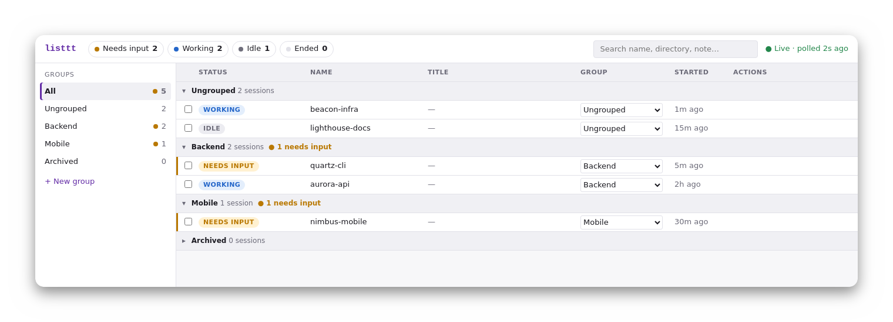

# listtt

A local, web dashboard for organizing your [Claude Code](https://docs.claude.com/en/docs/claude-code) sessions.

If you run several Claude Code sessions across different terminals and projects, it's easy to lose track of which one is waiting on you. listtt gives you one page that lists all of them, flags the ones that need your attention, and lets you jump straight to the right terminal tab.

It's a single Go binary with a plain HTML/CSS/JS frontend — no database, no accounts, no network calls beyond your own machine.

<p align="center">
  
</p>

## Table of contents

- [Features](#features)
- [Requirements](#requirements)
- [Build and run](#build-and-run)
- [How it works](#how-it-works)
- [Terminal focus support](#terminal-focus-support)
- [Known limitations](#known-limitations)

## Features

- See every interactive session at a glance, and which ones **need input** (a permission prompt or question is open).
- Organize sessions into your own groups, by dropdown or drag-and-drop, and keep a note on each.
- Click a session to bring its terminal tab to the front (GNOME Terminal on Linux, Terminal.app on macOS).
- Ended sessions stay visible for 7 days, then move to Archived along with their group and note.

## Requirements

- [Claude Code](https://docs.claude.com/en/docs/claude-code) on your `PATH` (`claude agents --json` must work).
- Go 1.25 or later, to build.
- Linux or macOS.

## Install

requires Go 1.25+:

```bash
go install github.com/nya1/listtt@latest
listtt --open            # serves http://127.0.0.1:7777/ and opens your browser
```

Make sure `$(go env GOPATH)/bin` (or `~/go/bin`) is on your `PATH`.

To update: `go install github.com/nya1/listtt@latest` again.

## Build and run (from source)

```bash
go build -o listtt .
./listtt --open            # serves http://127.0.0.1:7777/ and opens your browser
./listtt --addr localhost:8080
```

Custom version string: `go build -ldflags "-X main.version=v0.1.0" -o listtt .`

`--addr` only accepts `127.0.0.1` or `localhost`, because the dashboard has no login — anyone who can reach the address can see and control your sessions.

## How it works

- Every 3 seconds, listtt runs `claude agents --json` and refreshes the dashboard. A session with status `waiting` shows as **Needs input**.
- Groups, notes, and last-seen times are stored locally in `store.json`:
  - Linux: `~/.config/listtt/store.json`
  - macOS: `~/Library/Application Support/listtt/store.json`
- listtt never modifies `~/.claude` and installs no hooks — it only reads.
- If the store file is corrupt, listtt refuses to start rather than risk overwriting it.

## Terminal focus support

| Terminal | Focus | How |
|---|---|---|
| GNOME Terminal (Linux) | Yes | Reads `GNOME_TERMINAL_SCREEN` from the session's environment, then `gdbus` `ActivateResult` |
| Terminal.app (macOS) | Yes | `osascript` selects the tab whose `tty` matches the session |
| tmux, VS Code, iTerm2, others | No | Listed with status and notes, but no Focus action |

### macOS: Automation permission

The first focus click triggers a macOS prompt such as *"Terminal wants to control Terminal"* or *"iTerm2 wants to control Terminal"*, naming the app you started `listtt` from. Allow it.

If you clicked **Don't Allow**, focus will keep failing. Fix it under System Settings → Privacy & Security → Automation, or reset the decision so the prompt appears again:

```bash
tccutil reset AppleEvents com.apple.Terminal   # use the bundle id of the app you start listtt from
```

## Known limitations

- A session waiting on Claude Code's "trust this folder" dialog isn't listed until the folder is trusted.
- Status updates reach the dashboard within about 3 seconds, not instantly.
- `claude agents --json` isn't a documented, stable contract. If it changes, the top bar shows "claude CLI unreachable".
- macOS: a Terminal window in Split View can't be scripted until you click it once.
- macOS 26: focus-stealing prevention can occasionally keep Terminal from coming to the front.

Design details: [`docs/superpowers/specs/2026-09-12-listtt-session-dashboard-design.md`](docs/superpowers/specs/2026-09-12-listtt-session-dashboard-design.md).
